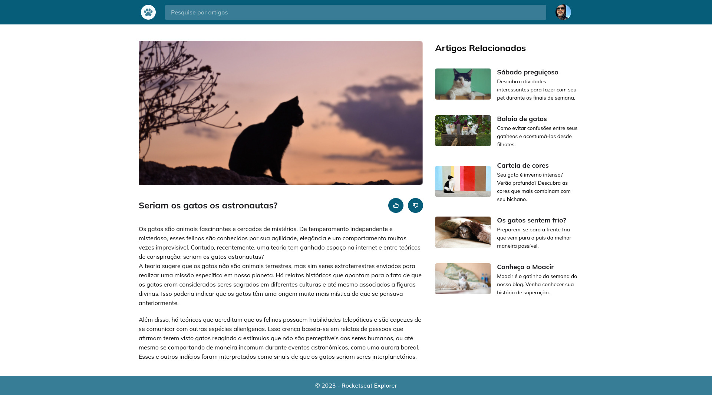

Projeto realizado no treinamento do Explorer da Rocketseat  
<a href="https://www.rocketseat.com.br/explorer">Estude esse projeto em formato de vídeo clicando aqui.</a>

  <a href="#-tecnologias">Tecnologias</a>&nbsp;&nbsp;&nbsp;|&nbsp;&nbsp;&nbsp;
  <a href="#memo-licença">Licença</a>

  

 

  

## 🚀 Tecnologias

Esse projeto foi desenvolvido com as seguintes tecnologias:

- HTML e CSS
- Git e Github
- Figma

## 💻 Projeto

Blog de Gatos

Projeto desenvolvido como desafio do Stage 03 do programa Explorer da Rocketseat. Nele foi utilizado técnica de Mobile First, CSS Grid e animação.

## :memo: Licença

Esse projeto está sob a licença MIT.

---

Feito com ♥ by Rocketseat :wave: [Participe da nossa comunidade!](https://discord.gg/rocketseat)